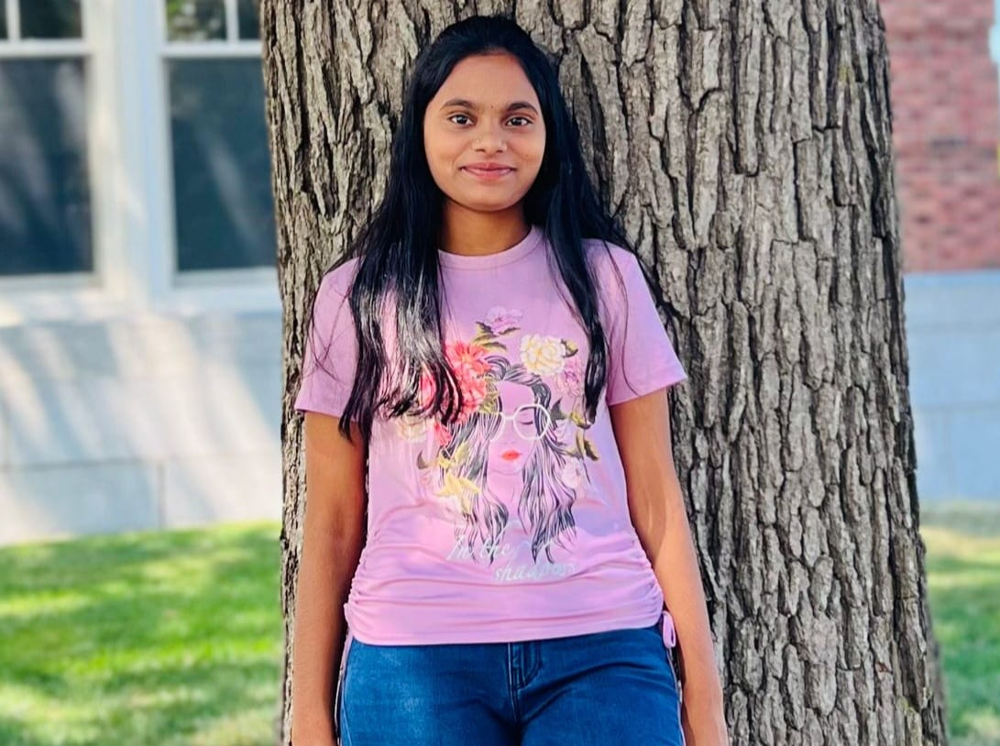

# Udayasri Prasadam

I am Udayasri Prasadam from Guntur, Andhra Pradesh, India. I completed my bachelor's at Qis college of engineering and technology in 2022, Ongole. I want to enhance my skills in wedapps through this course. In the future, I want to pursue Ph.D.

Link in the image: 

---

## Cities

I love to visit the below places. I would like to recommend this place to others to visit. The below table shows the information about the most famous place in those cities.

| City | Location | Time Duration |
| --- |  ---  |  ---  |
|Chennai | Queensland Amusement Park | 7 days |
|Mangaluru | Tannirbhavi Beach | 4 days |
|Rishikesh | Triveni Ghat | 3 days |
|Mumbai |  Gateway Of India Mumbai | 1 day |

---

## Pithy Quotes 

> “It's always darkest before you're blinded by the light.” *josh stern*

> “The best kind of praise is intelligent praise.” *Rachel Heffington*

---

## Code Fencing 

> add_rewrite_rule not working with custom post type <https://stackoverflow.com/questions/73642768/add-rewrite-rule-not-working-with-custom-post-type>

```
<h3>All Post Meta</h3>

<?php 

  // Get all the data 
  $getPostCustom = get_post_custom(); 

    foreach($getPostCustom as $name=>$value) {

        echo "<strong>" . $name . "</strong>"."  =>  ";

        foreach ($value as $nameAr=>$valueAr) {
                echo "<br />";
                echo $nameAr."  =>  ";
                echo var_dump($valueAr);
        }

        echo "<br /><br />";

    }
?>
```

Link to the code snippet <https://css-tricks.com/snippets/wordpress/dump-all-custom-fields/>


